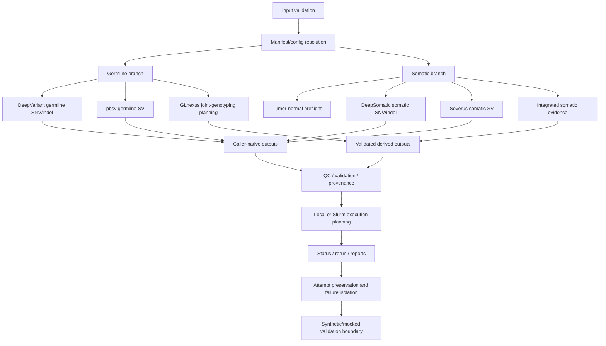

# PacBio Variant Analysis Harness

Research-use PacBio variant-analysis orchestration for germline and somatic workflows, with DeepVariant, pbsv, GLnexus, DeepSomatic, Severus, HPC planning, QC, provenance, and failure recovery.


> Research use only. Software architecture, orchestration, validation logic, mocked execution, and synthetic-scale planning have been tested. Full biological and production validation on real tumor and germline cohorts remains future work.

## Overview

This repository turns a historical interactive PacBio variant-analysis script into a configuration-driven Python harness for reproducible research workflows. It separates germline, somatic small-variant, somatic structural-variant, cohort, Slurm-planning, QC, provenance, and reporting concerns.

Public repository: [Tay45/pacbio-variant-analysis-harness](https://github.com/Tay45/pacbio-variant-analysis-harness)

## Why This Project Exists

Variant analysis projects often fail at the operational edges: inconsistent manifests, reference drift, unsafe shell commands, unclear retries, missing provenance, caller-version changes, and incomplete failure isolation. This harness demonstrates a research-computing architecture that makes those edges explicit and testable.

## Core Capabilities

- PacBio HiFi germline SNV/indel orchestration with DeepVariant.
- PacBio HiFi germline structural-variant orchestration with pbsv.
- Optional germline gVCF discovery and GLnexus joint-genotyping planning.
- Somatic tumor-normal and guarded tumor-only manifest/preflight modeling.
- DeepSomatic somatic SNV/indel command construction, mocked execution, validation, QC, and reports.
- Severus somatic SV command construction against committed official-contract fixtures, mocked execution, VCF/BND validation, QC, and reports.
- Integrated somatic evidence reporting above DeepSomatic and Severus without collapsing their analytical semantics.
- Local and Slurm planning, attempt preservation, failure isolation, rerun manifests, provenance, and synthetic scale tests.

## Validation Boundary

The validated scope is software behavior: schema validation, command construction, contract checks, mocked execution, output parsing, failure recovery, reports, and deterministic synthetic 3,000-sample or 3,000-pair planning/reporting tests. Real-tool smoke testing, real-data validation, biological benchmarking, production validation, clinical interpretation, CNV, and annotation remain outside this alpha release.

The current implementation targets PacBio workflows. Illumina and Oxford Nanopore workflows are not implemented or validated in this release.

## Architecture At A Glance



See [system architecture](docs/architecture/system_architecture.md).

## Supported Workflows

| Workflow | Status | Validation scope |
| --- | --- | --- |
| Germline SNV/indel | Implemented | Unit and mocked integration tests |
| Germline SV | Implemented | Unit and mocked integration tests |
| Germline joint genotyping | Planning implemented | Synthetic scale tests |
| Somatic preflight | Implemented | Unit and synthetic scale tests |
| DeepSomatic | Planning/mocked execution implemented | Contract/config/output/QC tests |
| Severus | Planning/mocked execution implemented | Official-contract, VCF/BND, QC tests |
| Integrated somatic reporting | Implemented | Mocked and 3,000-pair synthetic reporting tests |

## Germline Workflow

Germline logic keeps DeepVariant SNV/indel analysis and pbsv structural-variant analysis modular. See [germline docs](docs/germline_workflow.md).

## Somatic Workflow

Somatic logic models tumor-normal semantics, guarded tumor-only policy, identity checks, and caller-specific outputs separately. See [somatic overview](docs/somatic_overview.md).

## DeepSomatic Integration

DeepSomatic is used only for somatic small-variant workflows. See [DeepSomatic overview](docs/deepsomatic_overview.md).

## Severus Integration

Severus is used for long-read somatic structural-variant workflows through a committed versioned contract fixture. See [Severus overview](docs/severus_overview.md).

## Integrated Somatic Evidence Layer

The integrated layer summarizes validated DeepSomatic and Severus attempts, checks pair/reference compatibility, records partial success honestly, reports technical regional relationships, and creates operator and portfolio summaries. See [integrated overview](docs/integrated_somatic_overview.md).

## HPC And Cohort Orchestration

The harness creates local and Slurm plans without requiring Slurm in standard tests. Cohort and array logic isolates failed samples or pairs from successful ones. See [operations docs](docs/README.md#operations).

## Validation And Testing

Standard tests are hermetic and do not run external callers, Slurm, containers, network downloads, or real sequencing data.

```bash
python scripts/run_tests.py -q
python scripts/verify_pytest_exit.py
python scripts/audit_public_repository.py
```


## Verification Evidence

Detailed test, scale, portability, network-isolation, caller-contract, and public-release evidence is archived under [`docs/validation/evidence/`](docs/validation/evidence/). These artifacts validate software behavior and packaging hygiene; they do not establish biological accuracy or clinical readiness.

## What Has Been Tested

- Configuration and manifest validation.
- Safe command construction.
- Mocked germline, somatic, DeepSomatic, Severus, and integrated workflows.
- Official Severus contract fixtures.
- VCF, SV, BND, QC, provenance, and reporting behavior.
- Deterministic synthetic 3,000-sample and 3,000-pair planning/reporting.

## What Has Not Been Tested

Real external tools, real human cohorts, production HPC throughput, biological accuracy, diagnostic performance, clinical reporting, CNV, annotation, cloud execution, and institutional deployment are not validated in this release.

## Quick Start

Start with [docs/getting_started/quick_start.md](docs/getting_started/quick_start.md).

## Example Commands

```bash
python -m pip install -e .
python -m variant_analysis_harness.cli --help
python scripts/run_tests.py -q
```

## Repository Map

See [docs/reference/repository_map.md](docs/reference/repository_map.md).

## Sample Reports

Synthetic examples are listed in [docs/portfolio/sample_reports.md](docs/portfolio/sample_reports.md).

## Portfolio Highlights

The project demonstrates senior bioinformatics engineering through platform-aware design, caller-contract validation, tumor-normal semantics, long-read phasing awareness, HPC planning, failure recovery, provenance, and honest validation boundaries. See [portfolio overview](docs/portfolio/portfolio_overview.md).

## Roadmap

See [ROADMAP.md](ROADMAP.md).

## Research-Use And Validation Disclaimer

This software is for research use only. It is not clinically validated, diagnostically validated, or intended for treatment decisions. Technical completion, mocked execution, and synthetic scale tests do not establish biological validity.

## Contributing

See [CONTRIBUTING.md](CONTRIBUTING.md).

## License

MIT License. See [LICENSE](LICENSE).

## Citation

See [CITATION.cff](CITATION.cff).
