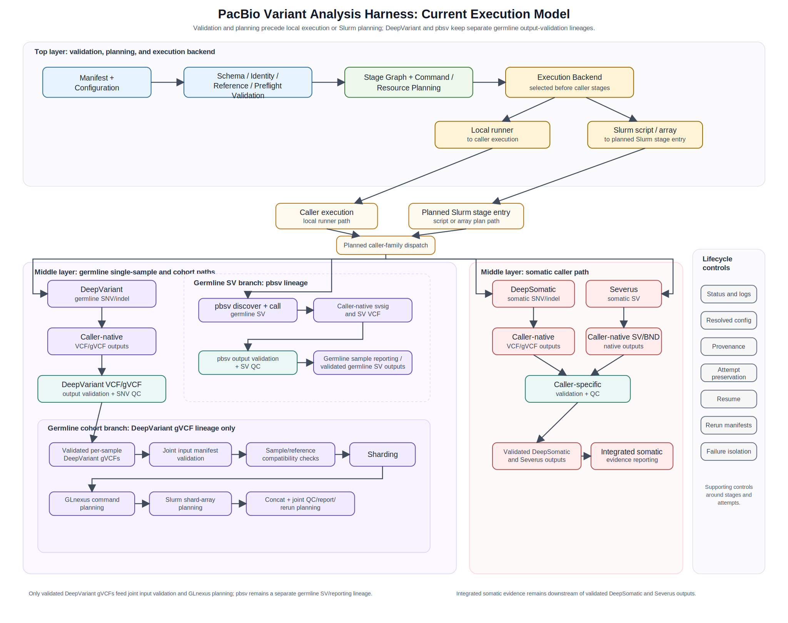

# System Architecture

Publication figure: [current_execution_model.svg](current_execution_model.svg).  
Raster export: [current_execution_model.png](current_execution_model.png).  
Logical Mermaid reference: [current_execution_model.mmd](current_execution_model.mmd).

The SVG is the authoritative visual source for the README and portfolio
appendix. The Mermaid file documents the architecture relationships, but it is
not intended to reproduce the exact publication layout or styling of the SVG.

The diagram is an execution model, not a biological interpretation model. The
current code resolves manifests and configuration, performs schema, identity,
reference, and preflight checks, and then builds deterministic stage graphs,
commands, resource requests, status paths, and output contracts before any
local stage execution or Slurm script generation.

Execution backends sit before caller stages:

- The local runner executes the planned stages and records attempt status.
- Slurm commands generate single-job or array scripts and task indexes for
  review; standard tests do not submit Slurm jobs.

Caller stages remain modular:

- Germline single-sample stages may run DeepVariant for SNV/indel output and
  pbsv for PacBio HiFi structural-variant output.
- GLnexus is a cohort-level joint-genotyping planning layer that consumes
  validated per-sample DeepVariant gVCFs. It is downstream of per-sample
  DeepVariant gVCF generation and validation, not a parallel single-sample
  germline caller stage.
- pbsv output validation and SV QC are a separate germline SV lineage. pbsv
  outputs may contribute to germline sample reporting, but they are not inputs
  to GLnexus.
- Somatic stages keep DeepSomatic small-variant planning and Severus
  structural-variant planning separate.
- Integrated somatic evidence is a derived reporting layer above validated
  DeepSomatic and Severus attempts; it does not replace or merge caller
  semantics.

Caller-native outputs remain caller-owned. Output-contract validation, QC,
provenance, status records, reports, rerun manifests, attempt preservation, and
failure isolation are recorded around those outputs so failed samples, pairs, or
shards can be reviewed and rerun independently.
