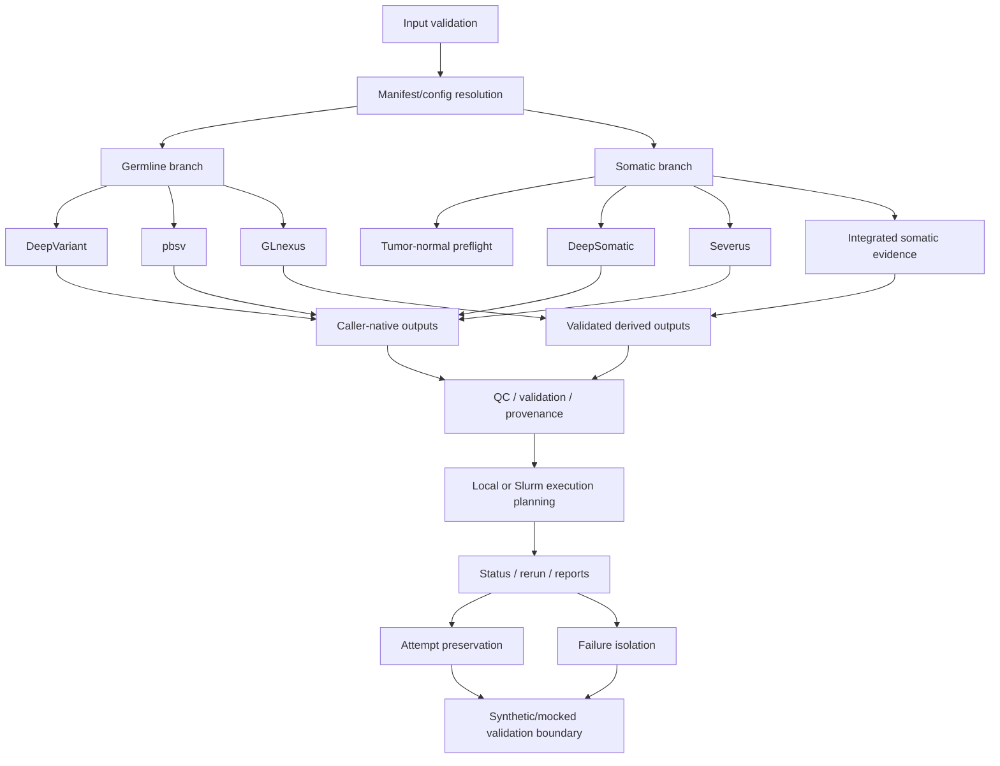

# System Architecture

Caller-native outputs remain caller-owned. Integrated reports are
derived outputs that link back to source attempts, validation status,
checksums where available, and provenance.
